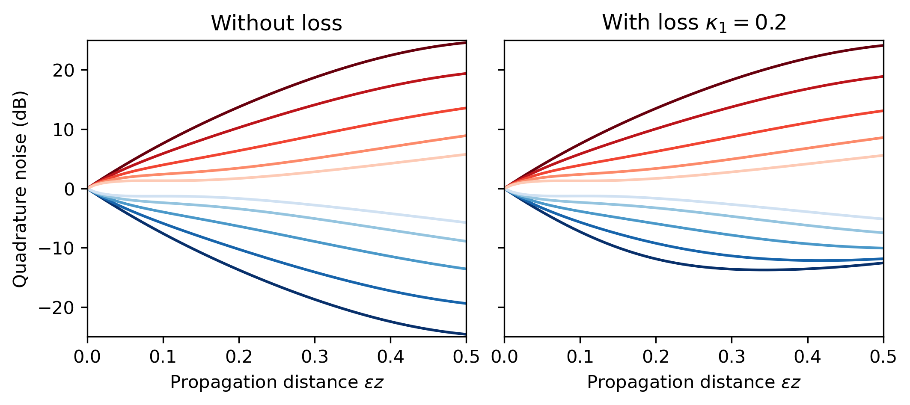

# Introduction
This package provides a simulation method for calculating the quantum dynamics of a multimode, one-dimensional field, subject to dispersion and nonlinearity.
The prototypical use case is nonlinear propagation of an ultrafast optical pulse in a waveguided medium.
However, the most general setup is any Heisenberg equation of motion of the form

$$
\mathrm{i} \partial_z \hat\Psi^{(i)}_x(z) = F^{(i)}(z,\hat\Psi_x(z)) + D^{(i)}(-\mathrm{i}\partial_x) \hat\Psi^{(i)}_x(z),
$$

where, for each $i$, $\hat\Psi_x^{(i)}$ is a vector-valued bosonic field operator defined on a grid with coordinate $x$. The field components $\hat\Psi^{(i)}_x$ satisfy

$$
\left\[ \hat\Psi_{x}^{(i)}, \hat\Psi_{y}^{(j)\dagger} \right\] = \delta_{ij} \delta(x-y).
$$

In an optical system, the index $i$ can, e.g., enumerate different pulse envelopes (e.g., fundamental- vs. second-harmonic), whereas $x$ would be the pulse coordinate (e.g., in femtoseconds).

Here, $F^{(i)}$ are any sufficiently well-behaved (nonlinear) functions (one for each field) that can depend on both the position and the field, and $D^{(i)}(-\mathrm{i}\partial_x)$ are linear operators acting on each field representing the effect of linear dispersion.
In this generic setting, we use $z$ to denote the coordinate along which $\hat\Psi_x$ evolves; we henceforth suppress the $z$ dependence of our field.

In the classical theory (i.e., when $\hat\Psi_x$ is replaced by a c-number function of $x$), an efficient way to solve the dynamics is to use a split-step Fourier (SSF) method, in which the first term is applied on the "real space" grid $x$ while the second term is applied in the "reciprocal space" of $x$; in reciprocal space with coordinate $\xi$, the action of $D^{(i)}$ becomes simply $D^{(i)}(2\pi\xi)\hat\Psi^{(i)}_\xi$, acting on the Fourier transform of $\hat\Psi_x$.
In this package, we provide functionality for extending such SSF methods to capture leading-order quantum effects.

More specifically, this package focuses on capturing second-order correlations in the quantum state via a *Gaussian-state approximation*, in which we derive equations of motion for both the mean-field components

$$\Psi^{(i)}_x = \langle\hat\Psi^{(i)}_x\rangle$$

as well as the covariance matrix elements

$$
\begin{align}
\Sigma_{x,y}^{(i,j)} &= \langle \delta\hat\Psi_x^{(i)} \delta\hat\Psi_y^{(j)}\rangle \\
\Pi_{x,y}^{(i,j)} &= \langle \delta\hat\Psi_x^{(i)\dagger} \delta\hat\Psi_y^{(j)}\rangle,
\end{align}
$$

where $\delta\hat\Psi_x = \hat\Psi_x - \langle \hat\Psi_x \rangle$ is the fluctuation operator corresponding to $\hat\Psi_x$. The mean-field components correspond to the usual classical field (with dynamical corrections), while the covariance matrices capture the statistics of quantum fluctuations and correlations.

Under appropriate conditions, we can formulate a Gaussian-state approximation of the dynamics in the generic form

$$
\begin{align}
\mathrm{i} \partial_z \Psi_x^{(i)} &= G^{(i)}(\Psi_x,\Sigma_{x,x},\Pi_{x,x}) + D^{(i)}(-\mathrm{i}\partial_x) \Psi_x^{(i)}, \\
\mathrm{i} \partial_z \Sigma_{x,y}^{(i,j)} &= G_\Sigma^{(i,j)}(\Psi_x,\Psi_y,\Sigma_{x,y},\Pi_{x,y}) + D^{(i)}(-\mathrm{i}\partial_x) D^{(j)}(-\mathrm{i}\partial_y) \Sigma_{x,y}^{(i,j)}, \\
\mathrm{i} \partial_z \Pi_{x,y}^{(i,j)} &= G_\Pi^{(i,j)}(\Psi_x,\Psi_y,\Sigma_{x,y},\Pi_{x,y}) + D^{(i)}(+\mathrm{i}\partial_x) D^{(j)}(-\mathrm{i}\partial_y) \Pi_{x,y}^{(i,j)},
\end{align}
$$

for appropriate functions $G$, $G_\Sigma$, and $G_\Pi$, which can be derived from $F$.
This set of equations describe the (nonlinear) evolution of the Gaussian moments of the state. Our numerical approach solves these Gaussian-moment equations using a split-step Fourier method, hence the name of the package GaussianSSF.jl.

# Installation

Note that [CUDA.jl](https://cuda.juliagpu.org/stable/installation/overview/) needs to be installed and functional in order to use this package. For now, a physical GPU is also required as `CuArray`s are generated internally; future development should target drop-in replacement of CuArrays with CPU arrays for small-scale numerical experiments.

This package is currently not registered. To install in Julia, see [Pkg.jl](https://pkgdocs.julialang.org/v1/) or run the line
```
Pkg.add(name="https://github.com/ngedwin98/GaussianSSF.jl", version="0.x")
```

# Quick Start
The following is a typical workflow. We focus on the use case of propagating an optical pulse in a nonlinear waveguide.

### 1. Set up grid
Choose the extent $X_\text{window}$ of the pulse window in $x$ and the number of grid points $N_\text{grid}$ within this window.
Optionally, you can check the real-space and reciprocal-space grid using `realspace` and `wavespace`:
```
x, dx = realspace(N_grid, X_window)
ξ, dξ = wavespace(N_grid, X_window)
```

### 2. Define propagation constants
Define the functions $D^{(i)}$ via a tuple of callables `D_funcs = (D1, D2, ...)` which can be evaluated on `ξ` (as defined above) to give the correct propagation constant for the corresponding field at the reciprocal-space coordinate $\xi$.
Note that this propagation constant can be complex-valued, with the imaginary part representing loss.

In general, the above construction allows you to build your own propagation constants for arbitrary dispersion models, but for simple situations, the package provides a convenience dispersion model `taylor`:
```
D = taylor(β), # or taylor(β...)
D_funcs = (D,)
```
will produce a Taylor-expanded dispersion model for a single field, which acts in reciprocal space as

$$
D(2\pi\xi) = \sum_{j=0}^{|\beta|-1} \frac{\beta_{j}}{j!} \, (2\pi\xi)^j
$$
where $|\beta|$ is `length(β)` and $\beta_j$ is `β[j+1]`. (Note that `taylor()` is also provided as a shorthand for `taylor(0,0,1)`.)

### 3. Specify nonlinear model
Instantiate a `Model` to represent the nonlinear interaction. For example, if we want to signify a nonlinear Schrodinger equation (NLSE) with coupling constant `g`, then we can use
```
model = NLSE(g)
```
More details about models which have been implemented in this package, as well as how to write your own models, are provided under [Implemented Models](#implemented-models).

### 4. Specify integration method
Instantiate an `Integrator` to represent an integration method for stepping the solution forward along $z$. Currently, this package has implemented RK4IP (a fourth order Runge-Kutta method in the interaction picture), which is a fixed-step method. To signify that we want to use such a method with a time step $\mathrm{d}z$, we can use
```
stepper = RK4IP(dz)
```

### 5. Create simulation object
Instantiate a `GSSFSim` object using all of the above information according to
```
sim = GSSFSim(stepper, model, N_grid, X_window, D_funcs)
```
The object `sim` contains all the data (states, linear operators, etc.) and background/cached data structures needed to *efficiently* step through the integration procedure.

The most useful field in `GSSFSim` is the *state* of the pulse, which accessed via `sim.state`. By default, for a quantum field with $M$ component, this produces a tuple representing all the Gaussian moments in the following order:

$$
\left(\psi^{(1)}, \ldots, \psi^{(M)},
\Sigma^{(1,1)}, \Pi^{(1,1)},
\ldots,
\Sigma^{(1,M)}, \Pi^{(1,M)},
\Sigma^{(2,2)}, \Pi^{(2,2)},
\ldots,
\Sigma^{(2,M)}, \Pi^{(2,M)},
\ldots,
\Sigma^{(M,M)}, \Pi^{(M,M)}
\right)
$$

However, this default behavior can be modified (e.g., if we wish to neglect certain Gaussian moments or know certain moments are zero by symmetry). This can be done by implementing your own method for the function `linear_setup` on different subtypes of `Model`: See more information under [Implementing new models](#implementing-new-models).

### 6. State initialization
Initialize the state by calling `init_state!` on `sim` according to
```
init_state!(sim, init_funcs...)
```
where each element `sim.state[i]` is filled by evaluating `init_funcs[i]` on `x` (if `sim.state[i]` is a vector) or on the meshgrid of `x` (if `sim.state[i]` is a matrix).
Here, `length(init_funcs)` can be smaller than `length(sim.state)`, in which case the following elements of `sim.state` are not modified.

For the [specialized model `ParallelizedMC`](##monte-carlo-classical-trajectories) which runs parallel Monte-Carlo simulations of classical trajectories with different initial conditions, multiple dispatch on `ParallelizedMC` has been defined to also add random noise to the background to simulate the effects of quantum noise.

### 7. Run simulation
Run the simulation! This can be done either by calling
```
step!(sim, z)
```
which takes one step of the `Integrator`, or by calling
```
gssf!(sim, N_steps], N_save=1, save_fun!=Array.(sim.state))
```
which repeats `step!` for `N_steps` iterations starting from $z = 0$ (and, for `RK4IP` as the stepper, in steps of `dz`).
Furthermore, whenever `div(N_steps, N_save) == 0` evaluates true, the result of `save_fun!(sim)` is appended to a data structure `output`.
By default, `save_fun!` simply converts the entirety of `sim.state` into a tuple of `Array`s (from `CuArray`s).
At the end of the iteration, `output` is returned along with a corresponding vector `z` describing the value of $z$ at which the elements of output were obtained.

### 8. Analyze simulation results
Finally, one can analyze the simulation results. This can either be done by looking at `sim.state` which provides the full Gaussian approximation of the quantum state at the end of the simulation (note that this is still stored as a tuple of `CuArray`s!), or by looking at `output` if `gssf!` was used.

# Implemented models

## Nonlinear Schroedinger equation (NLSE)

Implemented by `NLSE <: Model`.

Let $\hat\Psi_x$ be a single-component field, so that we can drop the superscript indices. For a real coupling parameter $g$,

$$
F(z, \hat\Psi_x) = g \hat\Psi_x^{\dagger2} \hat\Psi_x^2.
$$

In an optical system, this describes 4-wave mixing nonlinearity.
The resulting $G$, $G_\Sigma$ and $G_\Pi$ functions are derived in [[1](#gssfpaper)] and implemented here.

## Linearized NLSE

Implemented by `Linearized{NLSE} <: DerivedModel <: Model`.

A common simplification made to NLSE dynamics is to assume that the quantum noise does not participate in nonlinear dynamics.
This can be implemented mathematically by removing all terms that are nonlinear in covariance terms.
That is, we assume that $\langle\hat\Phi_x\rangle$ is order unity, while $\langle\hat\Phi_y\hat\Phi_x\rangle \sim \langle\hat\Phi_y^\dagger\hat\Phi_x\rangle \sim O(\varepsilon)$, and we only keep terms in the equations of motion up to $O(\varepsilon)$.
This effectively simplifies the form of the $G$, $G_\Sigma$ and $G_\Pi$ functions.

## Quasi-degenerate 3-wave mixing (QD3WM)

Implemented by `QD3WM <: Model`.

Let $\hat\Psi_x^{(1)} = \hat\Phi_x$ and $\hat\Psi_x^{(2)} = \hat\Psi_x$. For a real coupling parameter $\epsilon$,

$$
\begin{align}
F^{(1)}(z, \hat\Phi_x, \hat\Psi_x) &= \mathrm{i}\epsilon \hat\Psi_x \Phi^\dagger_x \\
F^{(2)}(z, \hat\Phi_x, \hat\Psi_x) &= -\frac{\mathrm{i}\epsilon}{2} \Phi^2_x.
\end{align}
$$

In an optical system, $\hat\Phi_x$ decribes a fundamental envelope while $\hat\Psi_x$ describes the corresponding second-harmonic envelope, and this model describes 3-wave mixing, e.g., between pump in the former and signal/idler in the latter.
The resulting $G$, $G_\Sigma$ and $G_\Pi$ functions are derived in [[1](#gssfpaper)] and implemented here.

## Vacuum-squeezing QD3WM

Implemented by `Squeezing{QD3WM} <: DerivedModel <: Model`.

For QD3WM, if the initial condition of the signal $\hat\Phi_x$ is assumed to be vacuum and the initial condition of the pump $\hat\Psi_x$ is assumed to be a coherent state, then by symmetry of the QD3WM system, we have the significant simplification that

$$
\langle\hat\Phi_x\rangle = \langle\hat\Psi_y\hat\Phi_x \rangle = \langle\hat\Psi_y^\dagger\hat\Phi_x \rangle = \langle\hat\Psi_y\hat\Psi_x\rangle = \langle\hat\Psi_y^\dagger\hat\Psi_x\rangle = 0.
$$

which implies that we can eliminate the Gaussian moments $\Psi_x$, $\Sigma^{(1,2)}$, $\Pi^{(1,2)}$, $\Sigma^{(2,2)}$, and $\Pi^{(2,2)}$, resulting in 1 fewer 1D FFT and 4 fewer 2D FFTs.
In addition, we no longer need to define the corresponding nonlinear functions $G^{(1,2)}_\Sigma$, $G^{(1,2)}_\Pi$, $G^{(2,2)}_\Sigma$, and $G^{(2,2)}_\Pi$.
The remaining $G$, $G_\Sigma$ and $G_\Pi$ functions are derived in [[1](#gssfpaper)] and implemented here.

## Linearized vacuum-squeezing QD3WM

Implemented by `Linearized{Squeezing{QD3WM}} <: DerivedModel <: Model`.

A further approximation can be made by assuming that all the dynamics are linear: This is physically equivalent to an undepleted-pump approximation for vacuum squeezing in QD3WM.
In this case, we have some additional simplifications in the nonlinear functions: $G^{(2)} = 0$, while $G_\Sigma^{(1,1)}$ and $G_\Pi^{(1,1)}$ are further simplified.

## Classical QD3WM

On the extreme end, we can fully classicalize the QD3WM model, which assumes that a coherent state for all fields throughout the evolution. That is, all elements $\Sigma = \Pi = 0$, so we also have $G_\Sigma = G_\Pi = 0$.
In this case, we also set $G(\Phi_x, \Psi_x) = F(\Phi_x, \Psi_x)$ (dropping hats on the arguments to $F$).

## Monte-Carlo classical trajectories

Implemented by `ParallelMC{Classical{<:Model}} <: DerivedModel <: Model`.

This is a specialized model which is meant to run many classical trajectories in parallel, seeded by random noise in the initial condtion. (This is done by dispatching on the function `init_state!`.)
The equations of motion are exactly the same as those for its underlying `Classical` model.
However, the state of the simulation is structured as a matrix whose columns represent different trajectories, and the linear step instead performs parallel 1D FFTs along the columns.

# Implementing new models

It is a central goal of this package to be as generic as possible. For that reason, in addition to the models implemented above, we also need an extensible framework for adding custom models, corresponding to custom coupled-wave equations. A full description of how this system works is forthcoming. Adventurous experts should look at the `Model` type, its subtypes, and how the various functions dispatch on them; also important to this system are the setup functions `nonlinear_setup` and `lineaer_setup`.

# Example

## Pulsed vacuum squeezing
We consider vacuum squeezing on a $\chi^{(2)}$-nonlinear waveguide pumped by a broadband pulse. For the simulation, we first set the number of grids and the size of the simulation window:
```
N_grid = 2^8
X_window = 10.0

x, dx = realspace(N_grid, X_window)
ξ, dξ = wavespace(N_grid, X_window)
```
The three-wave mixing interaction on a $\chi^{(2)}$ waveguide involves fundamental harmonics and second harmonics with field operators $\hat{\Psi}_x^{(1)}(z)$ and $\hat{\Psi}_x^{(2)}(z)$, respectively. The nonlinear part of the coupled-wave equation takes a form
$$
F^{(1)}(z,\hat{\Psi}_x(z))=\epsilon \hat\Psi_x^{(1)\dagger}(z)\hat\Psi_x^{(2)}(z)
$$
$$
F^{(2)}(z,\hat{\Psi}_x(z))=\frac{\epsilon}{2}\hat\Psi_x^{(1)2}(z),
$$
which can be defined via the code
```
ϵ = 1.0
model = QD3WM(ϵ)
```
For the linear part of the dynamics, we can define the linear operators as
```
β1_2 = 1.0
β2_2 = 2.0
κ1 = 0.2
κ2 = 0.0

β1 = taylor(0, 0, β1_2, 0) 
β2 = taylor(0, 0, β2_2, 0)
D1(k) = β1(k) - im*κ1
D2(k) = β2(k) - im*κ2
```
for instance, where ``κ1`` and ``κ2`` are the loss rates of FH and SH, respectively, and we have assumed zero phase- and group-velocity mismatch. 

The functions ``model``, ``D1`` and ``D2`` characterizes the structure of the coupled-wave equations on the analytic level. For practical numerical simulations, we also need to specify the total propagation time ``Z``, the number of time steps ``N_steps``, and the number of time slices to save the data ``N_save``. These system parameters can be specified as
```
Z = 0.5
N_steps = 400
N_save = 50

sim = GSSFSim(RK4IP(Z/N_steps), model, N_grid, X_window, (D1,D2))
```
where ``sim`` object defines an RK4 integrator to solve the coupled-wave equations.

Finally, we specify the initial condition for the simulation ``init``. As an example, we consider an initial coherent Gaussian pump pulse with width ``σz`` and peak amplitude ``β0`` as
```
σx = 0.5
β0 = 10.0

φ1 = zero
φ2(x) = β0*exp(-x^2/(2σx^2))

init_state!(sim, φ1, φ2)
```
where the initial signal state is a vacuum.

Now, we are ready to run the simulation by a line of code
```
output, zout = gssf!(sim, N_steps, N_save)
```
The output contains the mean-field and covariance matrices of the fields. By calculating the eigenvalues of the signal covariance matrix, we obtain pulse quadratures that are squeezed/anti-squeezed. The figure below shows 5 pulse quadratures with largest and smallest noise quadrature. 



# References

1. <a name="gssfpaper"></a>Edwin Ng, Ryotatsu Yanagimoto, Marc Jankowski, M. M. Fejer, and Hideo Mabuchi. "Quantum noise dynamics in nonlinear pulse propagation".
